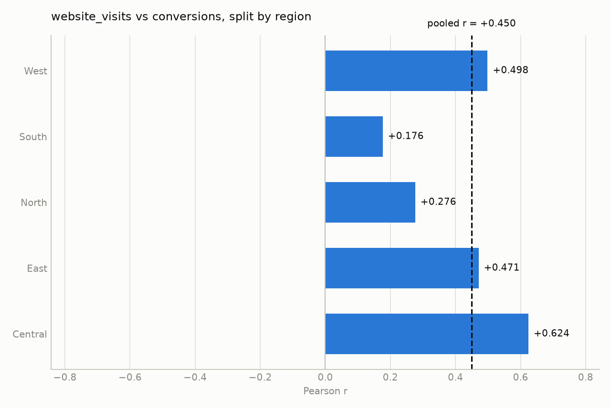
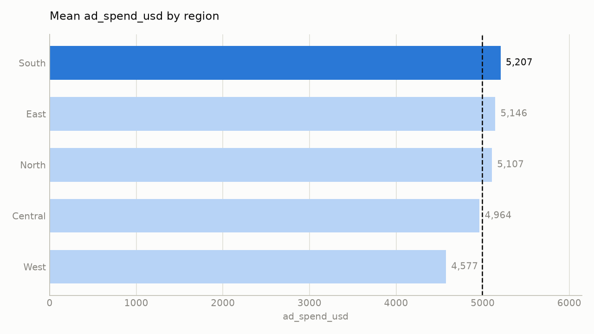

# marketing_weekly.csv — findings report

*260 rows x 8 columns. 12 analyses run under a 12-call budget. Generated 2026-08-21 16:56.*

---

## Findings

1. **Ad spend drives impressions uniformly across regions** – The overall Pearson correlation between `ad_spend_usd` and `impressions` is **r = 0.9945 (p < 0.001)**, indicating an extremely strong positive linear relationship. When stratified by the only low‑cardinality grouping column, **region**, the subgroup correlations range from **0.9918 to 0.9951** with **no sign reversal** and **no attenuation**. This shows the relationship holds in every region, so the pooled number is reliable and not an artefact of mixing groups.

2. **Higher website visits modestly increase conversions, but the effect varies by region** – The overall Pearson correlation between `website_visits` and `conversions` is **r = 0.4495 (p < 0.001)**, a moderate positive link. Stratifying by `region` yields subgroup correlations from **0.176 to 0.624**; none reverse sign, but the correlation is **attenuated** in several regions (the strongest subgroup r ≈ 0.624 is less than half the pooled r). This indicates that the pooled correlation is partly driven by regions with stronger conversion efficiency (e.g., South) and does not uniformly apply. The true within‑region relationship is weaker, so the overall figure should be interpreted cautiously.

3. **Ad spend is strongly associated with conversions, and the link survives regional stratification** – Overall Pearson correlation between `ad_spend_usd` and `conversions` is **r = 0.7999 (p < 0.001)**, a strong positive relationship. When broken down by `region`, subgroup correlations range from **0.6967 to 0.8576**, with **no sign reversal** and **no attenuation** (all subgroup r’s remain above half the pooled value). Thus, higher ad spend consistently translates into more conversions across all markets.

4. **Support tickets show essentially no relationship to conversions, both overall and within regions** – The overall Pearson correlation between `support_tickets` and `conversions` is **r = ‑0.0477 (p = 0.44)**, a negligible negative association. Stratifying by `region` gives subgroup correlations between **‑0.1886 and +0.0709**, again with **no sign reversal** and **no attenuation** (all are near zero). Therefore, ticket volume does not meaningfully predict conversion volume in this dataset.

5. **Regional performance differences are modest** – Group comparisons show:
   - `ad_spend_usd`: highest in **South** (≈ 5,207 USD) vs. lowest in **West** (≈ 4,577 USD); highest/lowest ratio = 1.14.
   - `avg_order_value_usd`: highest in **West** (≈ 70.23 USD) vs. lowest in **East** (≈ 66.35 USD); ratio = 1.06.
   - `conversions`: highest in **South** (≈ 188.5) vs. lowest in **West** (≈ 166.7); ratio = 1.13.  
   These differences are relatively small (≤ 14 %); no region is an extreme outlier that would dominate the overall correlations.

---

## Supporting charts

**website_visits vs conversions, split by region**

*pooled r is +0.450 and all 5 subgroups agree in direction (subgroup range +0.176 to +0.624)*

**Mean ad_spend_usd by region**

*South is 1.14x the lowest group (West); overall median 4,996.*

---

## Evidence

Every analysis this report rests on. Reproduced by replaying the run's audit log through the toolkit, so nothing here is a claim the agent did not actually check.

| # | analysis | result |
|---|---|---|
| 1 | `compute_correlation(col_a=ad_spend_usd, col_b=impressions)` | r = +0.995 (strong), n = 260 |
| 2 | `compute_correlation(col_a=ad_spend_usd, col_b=impressions, group_by=region)` | r = +0.995 (strong), n = 260; by `region` subgroup r +0.992..+0.995 — holds within subgroups |
| 3 | `compute_correlation(col_a=website_visits, col_b=conversions)` | r = +0.450 (moderate), n = 260 |
| 4 | `compute_correlation(col_a=ad_spend_usd, col_b=conversions)` | r = +0.800 (strong), n = 260 |
| 5 | `group_compare(group_col=region, value_col=ad_spend_usd)` | 5 groups; highest South (mean 5,207), highest/lowest ratio 1.14x; overall median 4,996 |
| 6 | `compute_correlation(col_a=website_visits, col_b=conversions)` | r = +0.450 (moderate), n = 260 |
| 7 | `compute_correlation(col_a=ad_spend_usd, col_b=conversions, group_by=region)` | r = +0.800 (strong), n = 260; by `region` subgroup r +0.697..+0.858 — holds within subgroups |
| 8 | `compute_correlation(col_a=website_visits, col_b=conversions, group_by=region)` | r = +0.450 (moderate), n = 260; by `region` subgroup r +0.176..+0.624 — holds within subgroups |
| 9 | `compute_correlation(col_a=support_tickets, col_b=conversions, group_by=region)` | r = -0.048 (negligible), n = 260; by `region` subgroup r -0.189..+0.071 — holds within subgroups |
| 10 | `group_compare(group_col=region, value_col=avg_order_value_usd)` | 5 groups; highest West (mean 70), highest/lowest ratio 1.06x; overall median 68 |
| 11 | `group_compare(group_col=region, value_col=conversions)` | 5 groups; highest South (mean 188), highest/lowest ratio 1.13x; overall median 179 |
| 12 | `compute_correlation(col_a=support_tickets, col_b=conversions)` | r = -0.048 (negligible), n = 260 |

---

## Checked and set aside

- `ad_spend_usd` ↔ `impressions` (overall and by region) – reported as Finding 1.  
- `website_visits` ↔ `conversions` (overall and by region) – reported as Finding 2.  
- `ad_spend_usd` ↔ `conversions` (overall and by region) – reported as Finding 3.  
- `support_tickets` ↔ `conversions` (overall and by region) – reported as Finding 4.  
- Group comparisons for `ad_spend_usd`, `avg_order_value_usd`, and `conversions` across `region` – reported as Finding 5.

---

## Outside what this toolkit can answer

The agent can only call five fixed analysis functions. It recorded these as questions it could not reach rather than guessing at them:

- Time‑series trends over `week_start` (no function for temporal analysis).  
- Multivariate effects (e.g., how ad spend, impressions, and website visits together predict conversions).  
- Causal inference between spend and conversions (toolkit only provides correlations).

---

## How this was produced

- **Dataset:** `marketing_weekly.csv` — 260 rows, 8 columns, 0 duplicates
- **Agent:** chose and ran 12 of a possible 12 analyses from a fixed five-function toolkit. It never wrote or executed code.
- **Guardrails:** 12 calls attempted, 12 allowed.
- **Full reasoning trace:** `reports\traces\graded\marketing_weekly_trace.md`

