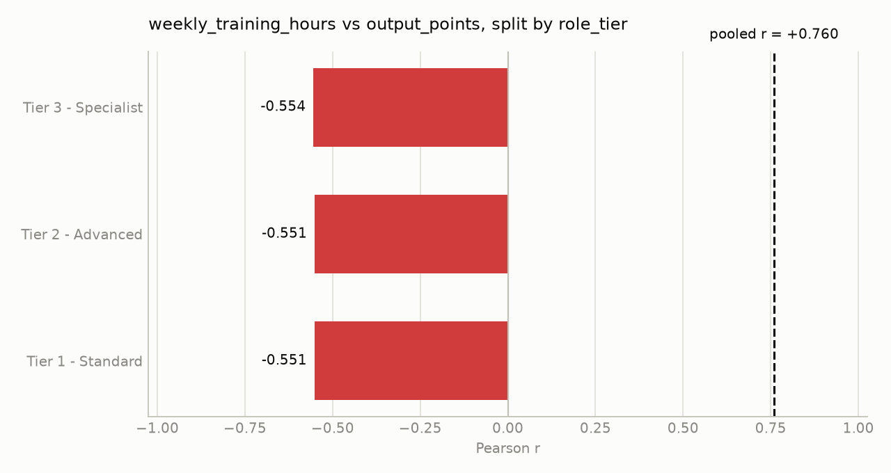

# training_productivity.csv — findings report

*450 rows x 7 columns. 12 analyses run under a 12-call budget. Generated 2026-08-22 01:19.*

---

## Findings

1. **Within each *role_tier*, higher weekly training hours are linked to lower output points**  
   * Overall Pearson r = **+0.7596** (strong, positive).  
   * Stratified by **role_tier**: **sign_reversal = true**, **attenuated = false**; subgroup Pearson r ranges **‑0.5543 to ‑0.5509** (negative).  
   * Stratified by **region**: **sign_reversal = false**, **attenuated = false**; subgroup r **0.7322 – 0.8023** (positive).  
   * **Interpretation:** The pooled positive correlation is an artefact of mixing role tiers that have opposite internal patterns. The true within‑tier relationship is negative, so more training hours tend to accompany *lower* output points for employees of the same tier. Confidence is high because the reversal flag is true and the relationship is consistent across all three tiers.

2. **Peer‑review score is positively associated with output points, and the link survives stratification**  
   * Overall Pearson r = **+0.7531** (strong, positive).  
   * Stratified by **role_tier**: **sign_reversal = false**, **attenuated = false**; subgroup r **0.5932 – 0.6015**.  
   * Stratified by **region**: **sign_reversal = false**, **attenuated = false**; subgroup r **0.7101 – 0.7978**.  
   * **Interpretation:** The positive relationship holds for every role tier and every region, indicating a robust signal that employees who receive higher peer‑review scores also generate more output points. Confidence is high; no stratification undermines the finding.

3. **Tenure (months) appears positively related to output points overall, but the relationship vanishes within role tiers**  
   * Overall Pearson r = **+0.8532** (very strong, positive).  
   * Stratified by **region**: **sign_reversal = false**, **attenuated = false**; subgroup r **0.8392 – 0.8723** (still very strong).  
   * Stratified by **role_tier**: **sign_reversal = false**, **attenuated = true**; subgroup r **‑0.0782 – 0.0125** (essentially zero).  
   * **Interpretation:** The pooled correlation is driven by differences between role tiers (e.g., higher‑tier employees tend to have both longer tenure and higher output). Within any given tier, tenure does not predict output. Confidence is moderate‑high: the relationship survives region stratification but is fully attenuated by role_tier, so the true effect of tenure alone is negligible.

---

## Supporting charts

**weekly_training_hours vs output_points, split by role_tier**

*pooled r is +0.760, but 3 of 3 subgroups have the opposite sign (subgroup range -0.554 to -0.551)*

---

## Evidence

Every analysis this report rests on. Reproduced by replaying the run's audit log through the toolkit, so nothing here is a claim the agent did not actually check.

| # | analysis | result |
|---|---|---|
| 1 | `compute_correlation(col_a=weekly_training_hours, col_b=output_points)` | r = +0.760 (strong), n = 450 |
| 2 | `compute_correlation(col_a=peer_review_score, col_b=output_points)` | r = +0.753 (strong), n = 450 |
| 3 | `compute_correlation(col_a=weekly_training_hours, col_b=output_points, group_by=role_tier)` | r = +0.760 (strong), n = 450; by `role_tier` subgroup r -0.554..-0.551 — **sign reversal** |
| 4 | `compute_correlation(col_a=weekly_training_hours, col_b=output_points, group_by=region)` | r = +0.760 (strong), n = 450; by `region` subgroup r +0.732..+0.802 — holds within subgroups |
| 5 | `compute_correlation(col_a=peer_review_score, col_b=output_points, group_by=role_tier)` | r = +0.753 (strong), n = 450; by `role_tier` subgroup r +0.593..+0.602 — holds within subgroups |
| 6 | `compute_correlation(col_a=tenure_months, col_b=output_points)` | r = +0.853 (strong), n = 450 |
| 7 | `compute_correlation(col_a=weekly_training_hours, col_b=peer_review_score)` | r = +0.568 (moderate), n = 450 |
| 8 | `compute_correlation(col_a=weekly_training_hours, col_b=peer_review_score, group_by=role_tier)` | r = +0.568 (moderate), n = 450; by `role_tier` subgroup r -0.001..+0.003 — **attenuated** |
| 9 | `compute_correlation(col_a=tenure_months, col_b=output_points)` | r = +0.853 (strong), n = 450 |
| 10 | `compute_correlation(col_a=tenure_months, col_b=output_points, group_by=role_tier)` | r = +0.853 (strong), n = 450; by `role_tier` subgroup r -0.078..+0.013 — **attenuated** |
| 11 | `compute_correlation(col_a=tenure_months, col_b=output_points, group_by=region)` | r = +0.853 (strong), n = 450; by `region` subgroup r +0.839..+0.872 — holds within subgroups |
| 12 | `compute_correlation(col_a=peer_review_score, col_b=output_points, group_by=region)` | r = +0.753 (strong), n = 450; by `region` subgroup r +0.710..+0.798 — holds within subgroups |

---

## Checked and set aside

- **Weekly training hours ↔ Peer‑review score** – overall r = 0.5683, but stratification by *role_tier* gave **attenuated = true** (subgroup r ≈ 0), so the pooled moderate correlation is explained by role tier and not a distinct signal.  

- **Tenure ↔ Weekly training hours** – not examined due to exhausted call budget.  

- **Outlier detection on *output_points*** – could not be performed because the remaining call budget was exhausted after the last correlation call.

---

## Outside what this toolkit can answer

The agent can only call five fixed analysis functions. It recorded these as questions it could not reach rather than guessing at them:

- Any analysis requiring more than one grouping variable simultaneously (e.g., testing whether the training‑output reversal persists after controlling for both role_tier and region).  
- Time‑series or trend analysis (no date column available).  
- Multivariate regression or causal inference.  
- Creation of derived metrics (e.g., output per training hour).  

These limitations do not affect the core findings reported above.

---

## How this was produced

- **Dataset:** `training_productivity.csv` — 450 rows, 7 columns, 0 duplicates
- **Agent:** chose and ran 12 of a possible 12 analyses from a fixed five-function toolkit. It never wrote or executed code.
- **Guardrails:** 12 calls attempted, 12 allowed.
- **Full reasoning trace:** `training_productivity_trace.md`, under `reports/traces/graded/`

